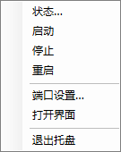

# dsh-harness-control

> One-click launch & management for the **DeepSeek Harness web GUI** on Windows.
>
> Start · Stop · Restart · Port control · System-tray controller

[](LICENSE) · [中文](README.md)

## What is this

[DeepSeek Harness](https://github.com/deepseek-ai/deepseek-harness) is DeepSeek's open-source AI agent workspace. It runs as a **browser-based GUI** on your machine: chat with DeepSeek models in a web page, and let the agent operate files, run commands, call tools, and orchestrate sub-agents.

```
You ──browser──> http://127.0.0.1:8081 (web GUI) ──> DeepSeek models + tools + plugins
```

However, `dsh web` is a **foreground process**: there is no daemon mode and no official stop command — close the terminal and it is gone. This repo turns that GUI into something you manage like a normal app: **start it, stop it, change its port**.

## Requirements

- **Windows 10 / 11** (scripts and tray are Windows-only)
- **Node.js ≥ 22** (required by DeepSeek Harness; `npm install` of this package enforces it)
- No manual `@deepseek-ai/dsh` install needed — it is pulled in automatically by npm/npx, and the scripts also auto-detect an existing dsh deployment or npx cache

## Preview



## Quick start

**Install (pick one):**

*Option A — clone the repo:*
```powershell
git clone https://github.com/Wutongdaozhi/dsh-harness-control.git
cd dsh-harness-control
npm install                       # installs @deepseek-ai/dsh
```
Then **double-click `install.cmd`** to create the desktop shortcut (no terminal needed; equivalent to `install.ps1`).

*Option B — existing dsh deployment:* copy the scripts into your deployment dir (see below).

*Option C — npm / npx (no clone):*
```powershell
npm install -g dsh-harness-control   # then use `dsh-harness-control` or the alias `dshctl`
# or without installing:  npx -y dsh-harness-control status
dshctl install      # create the desktop shortcut
dshctl tray         # start the system tray
dshctl start        # start the web GUI
dshctl status       # show status
```
(A global install bundles `@deepseek-ai/dsh` for out-of-the-box use; existing deployments can point at theirs with `-DshBin`.)

Then double-click the **DSH Harness** desktop icon — one click does everything:

```
double-click "DSH Harness"
  ├─ GUI not running → auto-starts
  ├─ browser opens → http://127.0.0.1:8081
  └─ system tray appears (whale icon in the notification area)
```

From then on, manage everything from the tray context menu: **Start · Stop · Restart · Port settings… · Open GUI · View logs · Autostart · Check updates… · Exit** (Exit only closes the tray, not the GUI). Only one tray instance can run at a time.

The tray icon reflects state: **blue whale = running, gray whale = stopped**. The "Autostart" menu item shows a ✓ for the current state and asks for confirmation before enabling.

## CLI (advanced)

```powershell
.\dsh-web.ps1 status                    # show status (default port 8081)
.\dsh-web.ps1 start                     # start in background (hidden window, logs to file)
.\dsh-web.ps1 start -Port 9000          # start on another port
.\dsh-web.ps1 start -OpenBrowser        # start and open the browser
.\dsh-web.ps1 start -Console            # start in a visible window (Ctrl+C to stop)
.\dsh-web.ps1 restart -Port 9000        # stop, then start on 9000
.\dsh-web.ps1 stop                      # stop (closes the GUI; sessions persist on disk)
.\dsh-web.ps1 logs                      # show recent logs
.\dsh-web.ps1 logs -Tail 200 -Follow    # follow the log (Ctrl+C to stop)
```

npm equivalents: `npm start` / `npm stop` / `npm status` / `npm restart` / `npm run logs`.

## Port settings

| Way | Notes |
|---|---|
| `-Port` / `--port` flag | one-off: `.\dsh-web.ps1 start -Port 9000` or `dsh web --port 9000` |
| Tray "Port settings…" | visual; persisted to `$env:DSH_HOME\dsh-web\tray-config.json` |
| Profile config | permanent default: edit `$env:DSH_HOME\profiles\web\cordis.patch.yml`, add `port: 9000` |

> `dsh web --host 0.0.0.0` is intentionally rejected by dsh for safety (remote code execution exposure); the GUI is loopback-only by design.

## Existing deployment (option B)

If you already have a directory with `npm install @deepseek-ai/dsh`, just copy `dsh-web.ps1`, `dsh-tray.ps1`, `dsh-tray.cmd`, `dsh-tray.ico`, `install.ps1` into it and run `.\install.ps1`. The scripts auto-locate dsh at `node_modules\@deepseek-ai\dsh\lib\bin.js` (or use `-DshBin`).

## Autostart (optional)

- **Tray menu "Autostart"**: shows a ✓ for the current state, asks for confirmation before enabling
- Or via CLI:

```powershell
.\install.ps1 -AutoStart        # start the tray at logon (asks for confirmation)
.\install.ps1 -AutoStart -Yes   # skip the confirmation prompt (scripting)
.\install.ps1 -RemoveAutoStart  # disable autostart
```

> Autostart changes system behavior (runs the tray and starts the GUI at every logon); the installer **asks for your explicit consent before enabling it**. Remove anytime with `-RemoveAutoStart` or by unchecking the tray menu item.

## Uninstall

```powershell
.\uninstall.ps1        # removes the desktop shortcut and autostart entry; asks before deleting the state directory
```
Or just **double-click `uninstall.cmd`** (same effect).

## How it works

- `dsh web` is a Node foreground process; `dsh-web.ps1` launches it hidden via `Start-Process`, records the PID in `$env:DSH_HOME\dsh-web\dsh-web.pid`, logs to `dsh-web.log` / `dsh-web.err.log`
- `stop` kills via the PID file (falls back to finding the process listening on the port)
- Sessions live in `$env:DSH_HOME\sessions`; after a restart, refresh the page to resume them

## FAQ

- **Double-clicking a `.ps1` opens Notepad** — use `dsh-tray.cmd` or the desktop shortcut (they include `-ExecutionPolicy Bypass`)
- **`stop` closed my web page** — that is the point of stopping; `start` again and refresh to resume sessions
- **Port in use** — switch with `-Port` or the tray; `--port 0` lets the OS pick one
- **Want autostart** — `.\install.ps1 -AutoStart`; remove with `-RemoveAutoStart`
- **Tray icon looks stale** — exit the tray and start it again (Windows icon cache)
- **dsh not found** — run `npm install @deepseek-ai/dsh` in the script directory, or pass `-DshBin <path-to-bin.js>`

## Layout

```
dsh-harness-control/
├── bin/cli.cjs          # npm/npx CLI entry (forwards to the PowerShell scripts)
├── dsh-web.ps1          # CLI controller (start/stop/status/restart/logs)
├── dsh-tray.ps1         # system-tray controller (one-click start + browser)
├── dsh-tray.cmd         # double-click launcher (starts the tray)
├── install.cmd          # double-click installer (creates the desktop shortcut)
├── uninstall.cmd        # double-click uninstaller (shortcut / autostart / state dir)
├── dsh-tray.ico         # blue whale icon (running); regenerate with make-tray-icon.cjs
├── dsh-tray-off.ico     # gray whale icon (stopped)
├── make-tray-icon.cjs   # icon generator (node make-tray-icon.cjs [out] [color])
├── install.ps1          # desktop shortcut + autostart installer
├── uninstall.ps1        # uninstaller (shortcut / autostart / state dir)
├── package.json         # npm scripts + @deepseek-ai/dsh dependency
├── docs/tray-menu.png   # tray menu screenshot
├── .github/workflows/   # CI: BOM / parse / PSScriptAnalyzer checks
├── README.md / README.en.md
└── LICENSE / .gitignore / .gitattributes
```

## License

MIT. The tray icon artwork is derived from `favicon.svg` inside the MIT-licensed [`@deepseek-ai/dsh-web-frontend`](https://www.npmjs.com/package/@deepseek-ai/dsh-web-frontend) package; the DeepSeek logo belongs to its owners — check brand guidelines before commercial use. Delete `dsh-tray.ico` to fall back to the default icon.
